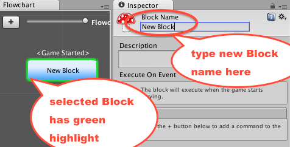
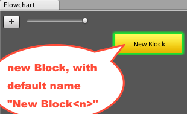
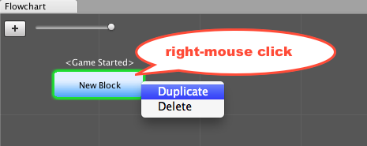
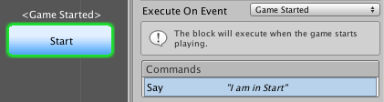

# Blocks {#blocks}

A fundamental concept of Fungus is the **Block**. Blocks contain your Fungus Commands, and reside inside Flowcharts.

<!-- **************************************************** -->
## Blocks (and how to inspect Block properties)

Blocks are found inside Flowcharts. Blocks are where your Fungus Commands are stored. Each Block can contain 1 or more Fungus Commands:

To inspect the properties of a Block do the following:

1. (setup) Create a Fungus Flowchart.

1. Click to select the default Block in the new Flowchart. You should see the Block's properties displayed in the Inspector window:
<br>

<br>
<br>

<!-- **************************************************** -->
## Setting Block name and description

When working with more than one Block, its important to name each Block in a meaningful way. To rename a Block do the following:

1. (setup) Create a Fungus Flowchart.

1. Click to select the default Block in the new Flowchart. The selected block has a green outline.

1. You should see the Block's properties displayed in the Inspector window:
<br>

<br>
<br>

1. In the Inspector change the text for the Block Name property to "Say Hello".

1. You should now see the Block has been renamed in the Flowchart window:
<br>

<br>
<br>

1. Now add a detailed description about the Block in the Description property in the Inspector window:
<br>


<!-- **************************************************** -->
## Creating a block

To create a new Block do the following:

1. (setup) Create a Fungus Flowchart (or be viewing the Flowchart for your current project).

1. Click the Add New Block button (the plus-sign "+") in the top-left of the Fungus Flowchart window:
<br>

<br>
<br>

1. A new Block should have been added to your Flowchart (with the default name "New Block", or "New Block1/2/3 etc." so each name is unique)
<br>


Note - a good time to choose a meaningful name a Block is immediately after creating a new Block ...

<!-- **************************************************** -->
## Delete a Block

To delete a Block from the current Flowchart, do the following:

1. (setup) Create a Fungus Flowchart (or be viewing the Flowchart for your current project).

1. Right-mouse-click over the Block you wish to delete, and choose menu: ```Delete```:
<br>

<br>
<br>

1. The Block should now have been removed from the Flowchart:
<br>


<!-- **************************************************** -->
## Duplicate a Block

To duplicate (clone / make an exact copy of) a Block from the current Flowchart, do the following:

1. (setup) Create a Fungus Flowchart (or be viewing the Flowchart for your current project).

1. Right-mouse-click over the Block you wish to duplicate, and choose menu: ```Duplicate```:
<br>

<br>
<br>

1. A copy of the Block should now have been added to the Flowchart (with "(copy)" appended the name of the duplicate):
<br>


Note - a good time to choose a meaningful name a Block is immediately after duplicating one ...

<!-- **************************************************** -->
## Moving blocks

To move / rearrange Blocks in the Flowchart window do the following:

1. (setup) Create a Fungus Flowchart (or be viewing the Flowchart for your current project).

1. Move a Block by clicking-and-dragging with the left mouse button:
<br>

<br>
<br>

1. When you release the mouse button the Block will remain where it was dragged:
<br>

<br>

<br>

<br>

<!-- **************************************************** -->
## The 3 types of Block (Event Block, Branching Block, Standard Block)

Fungus Flowcharts visually differentiate three differents kinds of Block behavior:

1. Event Block - blue rounded rectangle (Block execution triggered by an event)

1. Branching Block - orange polygon (passes control to 2 or more other Blocks, and not and Event Block)

1. Standard Block - yellow rectangle (no event, passes control to 0 or 1 other blocks)

### 1: Event Block - blue rounded rectangle
One way Fungus decides when to start executing the Commands inside a Block is if a Block has defined an Execute On Event. If a Block has any of the possible Execute On Events chosen (such as Game Started, Message Received, Sprite Drag Completed, Key Pressed etc.) then this Block will be displayed as a **blue rounded rectangle**:


As we can see, the default Block created with every new Flowchart automatically defines the Game Started Execute On Event, so this default Block always is displayed as an Event Block.

NOTE: A Block with an Execute On Event will always appear as an Event Block in the Flowchart, regardless of whether its Commands contain menus or calls to 2 or more Blocks). In other words, in terms of Flowchart appearance, display of an Event Block overrides display of a Branching Block.

### 2: Branching Block - orange polygon
If a Block is *not* an Event Block, and its Commands include Calls and/or Menu commands to execute Commands in 2 or more other Blocks, then in the Flowchart window this Block will be displayed as a Branching Block, visually appearing as an **orange polygon**.


### 3: Standard Block - yellow rectangle
If a Block is *neither* an Event Block *nor* a Command Block, then it is a Standard Block, and will be displayed as an **yellow rectangle**.


<!-- **************************************************** -->
## Connections between Blocks: Flow of Execution

A whole scene's logic can rarely fit all into a single Block, therefore we need ways for one Block to pass execution control to other Blocks. There are several ways to do this, the most common being:

1. the Call Command

1. the Menu Command

<!-- **************************************************** -->
## Executing Commands in another Block with the Call Command
The Call Command tells Fungus to go and start executing the Commands in named Block. There are several ways to do this, we can tell Fungus to Stop execution completely in the current Block, and just pass control to named Block. We can also tell Fungus to go and completed all Commands in the named Block, and when they are finished, to then continue executing any remaining commands in the current Block. Finally, and perhaps the most complicated/sophisticated technique, we can tell Fungus to both started executing Commands in a named Block WHILE simultaneously continuing to execute remaining Commands in the current Block.

To pass control to another Block, and stop executing Commands in the current Block, do the following:

1. (setup) If you have not already done so: Create a new scene, add a Fungus Flowchart to the scene, and select the Block in the Flowchart.

1. Rename this Block "Start".

1. Add to Block "Start" a Say Command with the Story Text "I am in Start".
<br>

<br>
<br>

1. Add a new Block to your Flowchart named "Block2".

1. Add to Block "Block2" a Say Command with the Story Text "I am in Block2".
<br>

<br>
<br>

1. Add to Block "Block2" a Call Command, by choosing menu: ```Flow | Call```:
<br>

<br>
<br>

1. With this Call Command Selected, in the Inspector choose Block2 from the list of Blocks for property **Target Block**:
<br>

<br>
<br>

1. Note: We will keep the default of **Target Flowchart** (None), which means the current Flowchart.

1. Note: We will keep the default of **Call Mode** Stop, which means that execution in the current Block (Start) will stop once execution of the called Block has begun.

1. You should now see an arrow in the Flowchart window, connecting Block "Start" with Block "Block2". This visually tells us (the game developer) that a Call or Menu Command is present inside Block "Start" that tells Fungus to execute commands in Block "Block2":
<br>

<br>
<br>

<!-- **************************************** -->
## Executing Commands in another Block with Menu Commands

Let's use a Say command above to ask a tricky mathematical question, and demonstrate the Menu command by offering the user a choice been "correct' and "incorrect" answers.  Menu commands transfer control to another block - so we'll need to add 2 new blocks to correspond to the 2 answers.
Do the following:

1. (setup) Create a new scene, add a Fungus Flowchart to the scene, and select the Block in the Flowchart.

1. Rename the Block in the Flowchart to "Question".

1. Create a Say command, with **Story Text** to ask the question: "Is 2 + 2?".

2. Uncheck the "Wait For Click" checkbox (this is so we see the menu options immediately after the Say command has displayed the question):
<br>

<br>
<br>

3. Create a new Block, named "Correct" which contains a **Say** command with the text "Well done, you are very mathematical!". Click the plus-sign button in the Flowchart window to add a new Block to the Flowchart, rename it "Correct" and then add that Say command:
<br>

<br>
<br>

4. Select the "Question" block, and add a Menu command by clicking the plus-sign add Command button in the Inspector and then choosing menu: ```Narrative | Menu```.
<br>

<br>
<br>

5. With this new Menu command selected (green) in the top half of the Inspector window, set the **Text** to "Yes" and the **Target Block** to your new "Correct" block:
<br>

<br>
<br>

6. You should now see how the 'flow' of commands can change from Block "hello" to Block "Correct" in the Flowchart window:
<br>

<br>
<br>

7. Add a second new Block named "Wrong", containing a Say command with text "Bad luck, perhaps consider a non-mathematical career path..."
<br>

<br>
<br>

8. Now we need to add another Menu command to our "hello" block, offering the user the "No" answer to our maths question, and passing control to Block "Wrong" if they disagree that 2 + 2 = 4. Select the "hello" block, and add a Menu command. With this new Menu command selected (green) in the top half of the Inspector window, set the **Text** to "No" and the **Target Block** to your new "Wrong" block.

9. You should now see in the Flowchart window how block "hello" can pass control to either block "Correct" or Block "Wrong" - depending on which menu answer the user selects.
<br>

<br>
<br>

10. Run the scene, and you should see the Say question appear at the bottom of the screen, and also the two Menu buttons "Yes" and "No" in the middle of the screen. Clicking "Yes" then runs the "Correct" Block's commands, and clicking "No" runs the "Wrong" block's commands:
<br>

<br>
<br>

<br>

<br>
<br>


<br>

<br>
<br>

<!-- **************************************************** -->
## Highlighting connection between blocks by selecting command

In the Inspector window, if you select a Call or Menu Command (executing Commands in another Block in **the same Flowchart**), then you'll see the arrow between the 2 Blocks highlighted in GREEN:


<!-- **************************************************** -->
## Setting a Block event handler

Events are one way to declare when you want execution of the Commands in a Block to begin. Typical events include:

- Game Started
- Flowchart enabled
- Message Received
- Key Pressed (Up / Down / Repeat)
- Sprite clicking / drag-dropping interactions

The most common Event used to define when a Block should start execution is, of course, the **Game Started** event. Each new Flowchart automatically starts with a single empty Block that is defined to begin execution when the game starts:


To change the Event defined for a Block, or to assign an event for a Block that had None, do the following:

1. Select the Block in the Flowchart window.

1. In the Inspector window, for property **Execute On Event** choose from the popup menu the desired Event:


