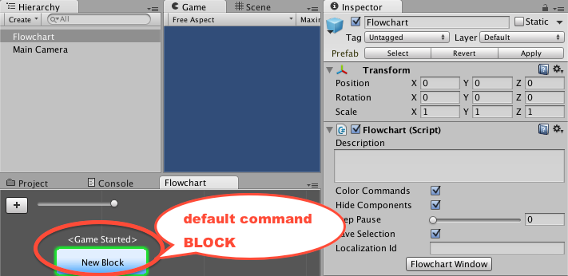
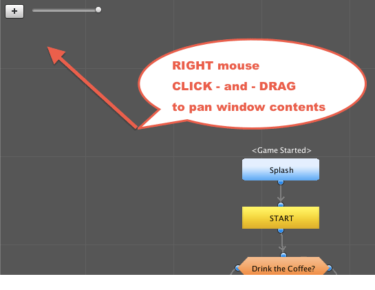

# Flowcharts {#flowcharts}

A fundamental concept of Fungus is the **Flowchart**. Scenes can contain a single Flowchart or multiple Flowcharts.

<!-- **************************************************** -->
## What is a Flowchart?

A Fungus **Flowchart** contains the Blocks in which all your Fungus Commands are located. A Unity scene can contain multiple Flowcharts, and commands can be executing simultaneously in different Flowcharts. However, for many games it is sufficient for one Block in one Flowcart to be executing at any one time.

Here is an example of a Fungus Flowchart:
<br>

<br>


<!-- **************************************************** -->
## Opening and docking the Flowchart window
You'll need the Fungus Flowchart window when working with Fungus. Open and dock this window somewhere handy by following these steps:

1. Choose menu: ``Tools | Fungus | Flowchart Window``
<br>

<br>
<br>

2. Drag-and-drop the Flowchart window to the location you wish to dock it:
<br>

<br>
<br>

3. The Flowchart window is now docked and part of your Unity window layout:
<br>


<!-- **************************************************** -->
## Creating a Flowchart
To create a Fungus Flowchart do the following:

1. Choose menu: ```Tools | Fungus | Create Flowchart```
<br>

<br>
<br>

2. A new **Flowchart** gameObject should appear in the Hierarchy window.
<br>

<br>
<br>

3. Select the **Flowchart** gameObject in the Hierarchy window, and you'll see the **Flowchart's** properties in the Inspector Window:
<br>

<br>
<br>

4. If you have not already displayed the Flowchart Window, you can do so by clicking the Flowchart Window button in the Inspector.

5. As you can see, when a new Flowchat is created a single command Block named "New Block" is automatically created, with the Event handler "Game Started" (so it will start executing Fungus commands as soon as the scene goes into **Play Mode**).

<!-- **************************************************** -->
## Panning the Flowchart window
Panning means moving the contents of the Flowchart window as if they are on a piece of paper. Click and drag with the RIGHT mouse button to pan the contents of the Flowchart window.





<!-- **************************************************** -->
## Zooming the Flowchart window
Zooming refers to making the contents larger or smaller. To zoom the Flowchart window contents either click and drag the UI slider, or use the mouse wheel (or trackpad).


